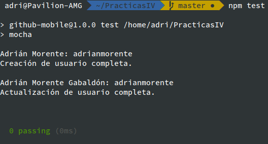

# Ejercicio 1

- Para empezar, descargamos el repositorio de [JJ/HitosIV](https://github.com/JJ/HitosIV) que contiene los tests de ejemplo e iniciación en el lenguaje *Go*.

- A continuación, instalamos el paquete `golang` (si fuera necesario, que en mi caso sí lo era); y ejecutamos el archivo de tests con el comando `go test`. La salida será la siguiente:


- *Si se nos ocurriera algún test adicional y/o faltante, nada más que hacer un **fork** y un **pull request** al repositorio original*.

***

# Ejercicio 2

- Para empezar con el testeo de funcionalidades de nuestra aplicación, comenzaremos por el nivel más bajo, **el de las aserciones**. Usaremos la librería estándar de JS (`assert`) tal que así:

```js
// test/user.js
var user = require('./../models/user.js');
var assert = require('assert');

// testing the creation of an user
var new_user = new user.User('Adrián','Morente','adrianmorente');
assert(new_user, "Usuario creado");
console.log(new_user.as_string());
assert.equal(new_user.as_string(), "Adrián Morente: adrianmorente", "Creado");
console.log("Creación de usuario completa.\n");
```

- En este ejemplo creamos un nuevo usuario del modelo previamente definido, y a continuación testeamos la creación con el método ***as_string()***, que deberemos implementar, y que será el que nos verifique (en forma de salida de texto) si se han introducido correctamente los datos en el usuario creado.

```js
// models/user.js

function User(firstname, lastname, gh_user){
  this.firstname = firstname;
  this.lastname = lastname;
  this.gh_user = gh_user;
};

User.prototype.as_string = function userToString(){
  return this.firstname + " " + this.lastname + ": " + this.gh_user;
};

module.exports = {
  User
};
```

***

- Por otro lado, otra aserción podría ser, en lugar de la que verifica la creación de un usuario; una que compruebe una actualización de algún atributo propio; como podría ser:

```js
// testing the update of an user
new_user.setLastName = "Morente Gabaldón";
console.log(new_user.as_string());
assert.equal(new_user.as_string(), "Adrián Morente Gabaldón: adrianmorente", "Actualizado");
console.log("Actualización de usuario completa.\n");
```

- Finalmente, el resultado de ambas aserciones (si hemos definido bien el modelo, claro) es el siguiente:



***

# Ejercicio 3

- Como indicamos en [el guión descriptivo del README.md](https://github.com/adrianmorente/PracticasIV/blob/master/README.md), instalamos `mocha` con `npm` y creamos la carpeta `test` para que la herramienta los evalúe automáticamente.

- Ahora actualizamos el código del ejercicio 2 referente al archivo [test/user.js](https://github.com/adrianmorente/PracticasIV/blob/master/test/user.js), añadiendo a la librería `assert` la gestión de `mocha` tal y como muestra [el guión de la asignatura](http://jj.github.io/IV/documentos/temas/Desarrollo_basado_en_pruebas#desarrollo-basado-en-pruebas-1). Quedaría tal que así:

```js
// test/user.js
var user = require('./../models/user.js');
var assert = require('assert');

describe('User', function(){
  // testing the load of the library
  describe('Load', function(){
    it('should be loaded', function(){
      assert(user, 'Loaded');
    });
  });

  // testing the creation of an user
  describe('Create', function(){
    it('should create user correctly', function(){
      var new_user = new user.User('Adrián','Morente','adrianmorente');
      assert.equal(new_user.as_string(), "Adrián Morente: adrianmorente", "Creado");
    });
  });

  // testing the update of an user
  describe('Update', function(){
    it('should update user correctly', function(){
      var new_user = new user.User('Adrián','Morente','adrianmorente');
      new_user.setLastName = "Morente Gabaldón";
      assert.equal(new_user.as_string(), "Adrián Morente Gabaldón: adrianmorente", "Actualizado");
    });
  });

});
```

- Y la salida obtenida al ejecutar `npm test` es la siguiente (con colorines, claro):


***

# Ejercicio 7

#### Crear una descripción del módulo usando `package.json`

- El archivo `package.json` ya lo hemos venido usando antes, ya que en él definimos los atributos del autor, el repositorio correspondiente, una breve descripción, etc.

- Además en él configuramos todas las dependencias en tiempo de instalación (añadiendo `--save` y/o `--save-dev` a nuestros comandos de instalación). Esto actualiza dicho fichero de forma que no se pierda ninguna dependencia por el camino.

- Además, en el apartado de scripts también definimos `mocha` como comando para realizar los tests en cada actualización del repositorio.

***

# Ejercicio 9

- Todo el contenido referente a este ejercicio (en cuanto a autenticación con Travis, etc.) ya se explicó en el fichero [README.md](https://github.com/adrianmorente/PracticasIV/blob/master/README.md).

- Finalmente, el fichero [`.travis.yml`](https://github.com/adrianmorente/PracticasIV/blob/master/.travis.yml) contiene lo siguiente:

```yaml
language: node_js
node_js:
 - "6"
 - "node"
 - "lts/*"
before_install:
  - npm install -g mocha
  - npm install
script:
  - npm test
```
