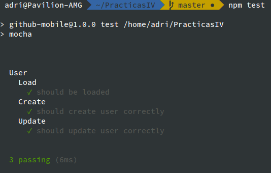

# Tema 2 - Ejercicio 3

- Como indicamos en [el guión descriptivo del README.md](https://github.com/adrianmorente/PracticasIV/blob/master/README.md), instalamos `mocha` con `npm` y creamos la carpeta `test` para que la herramienta los evalúe automáticamente.

- Ahora actualizamos el código del [`ejercicio 2`](./ejercicio2.md) referente al archivo [test/user.js](https://github.com/adrianmorente/PracticasIV/blob/master/test/user.js), añadiendo a la librería `assert` la gestión de `mocha` tal y como muestra [el guión de la asignatura](http://jj.github.io/IV/documentos/temas/Desarrollo_basado_en_pruebas#desarrollo-basado-en-pruebas-1). Quedaría tal que así:

```js
// test/user.js
var user = require('./../models/user.js');
var assert = require('assert');

describe('User', function(){
  // testing the load of the library
  describe('Load', function(){
    it('should be loaded', function(){
      assert(user, 'Loaded');
    });
  });

  // testing the creation of an user
  describe('Create', function(){
    it('should create user correctly', function(){
      var new_user = new user.User('Adrián','Morente','adrianmorente');
      assert.equal(new_user.as_string(), "Adrián Morente: adrianmorente", "Creado");
    });
  });

  // testing the update of an user
  describe('Update', function(){
    it('should update user correctly', function(){
      var new_user = new user.User('Adrián','Morente','adrianmorente');
      new_user.setLastName = "Morente Gabaldón";
      assert.equal(new_user.as_string(), "Adrián Morente Gabaldón: adrianmorente", "Actualizado");
    });
  });

});
```

- Y la salida obtenida al ejecutar `npm test` es la siguiente (con colorines, claro):


