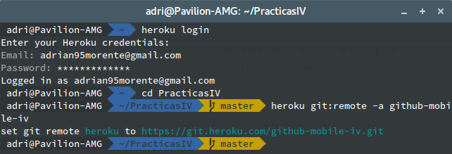
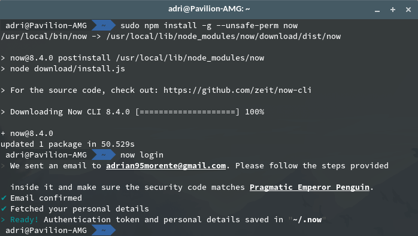
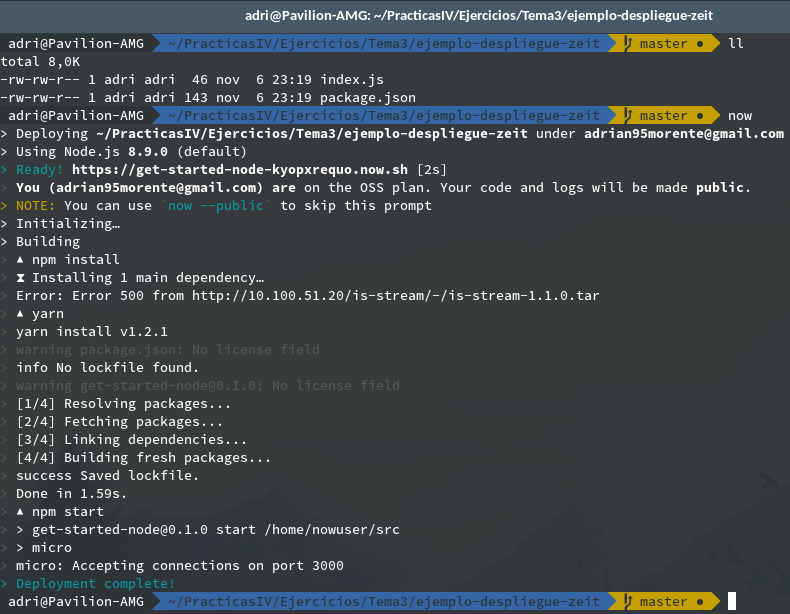
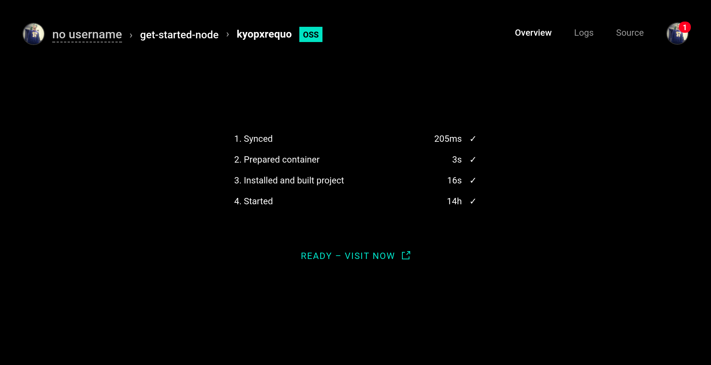
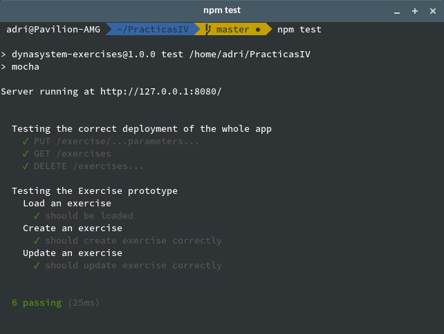
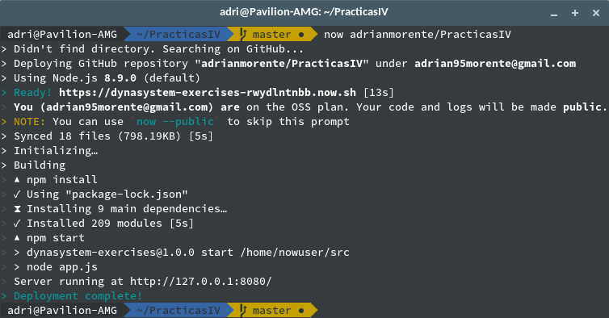
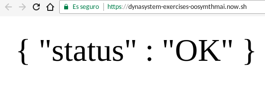

# Tema 3 - *Platform as a Service*.

## Ejercicio 1 - Prueba de PaaS y registro

Mi sistema de microservicios va a estar realizado en Javascript principalmente, de forma que podría elegir entre [ZEIT.co](https://zeit.co/), [Heroku](https://www.heroku.com/) y/o [Openshift](https://www.openshift.com/).

#### Openshift


- Pese a tener años de historia, parece que no está pasando por buen momento y está dando algunos fallos de registro e inicio de sesión a muchos usuarios. Por mi parte no tuve esos fallos, pero vi algunos issues *en alerta* en su código así que preferí optar por otra cosa.

#### Heroku

- En cuanto a Heroku, puede ser quizás la opción más considerable en cuanto a funcionamiento (y la interfaz es *nice & clean* y muy agradable al usuario). Sin embargo, solo ofrece 21 horas de servicio continuado al día; y busco una plataforma que me permita un servicio 24/7.



#### Zeit.co

- Es una plataforma un poco singular ya que solo permite contenedores sobre Javascript. Además, la instalación del cliente (`now`) se hace rápidamente con `npm` y a su vez éste genera el registro de usuario. Por cambiar un poco, elegiré este personalmente.



Tanto el login como el despliegue se hacen mediante línea de comandos. Con `now -h` consultamos todas las opciones disponibles. Además, en su documentación en la web enseñan a hacer despliegues de webs estáticas, de proyectos en Node.JS y de contenedores Docker.

***

## Ejercicio 2 - Crear una aplicación en el PaaS elegido y realizar despliegue de prueba

Como vemos en la documentación de [`zeit`](https://zeit.co/docs/getting-started/deployment#node.js-deployment), basta con tener un archivo ***package.json*** para que el cliente interprete que se trata de un microservicio bien hecho con Node. Usaremos el ejemplo propuesto en dicha documentación, que se basa en la herramienta [`micro`](https://github.com/zeit/micro).

Los fuentes del ejemplo están en la carpeta [ejemplo-despliegue-zeit](./ejemplo-despliegue-zeit), así como el archivo `package.json`, gracias al cual con ejecutar `npm install` ya tendremos las dependencias con las que lanzar la aplicación.

Una vez tenemos eso, basta con ejecutar `$ now` en el directorio donde esté el `package.json` correspondiente al proyecto y obtendremos la siguiente salida (*si todo va bien*):



Si visitamos el enlace generado aleatoriamente, llegamos a algo similar a la siguiente captura. En ella detalla el tiempo de compilación, despliegue, y el momentó en que se lanzó:



***

## Ejercicio 3 - Realizar una app en `express` que contenga rutas y variables

Con simples rutas como las siguientes, y utilizando los parámetros `req.params` podemos utilizar parámetros variables en nuestro código que dependan de las entradas. Además, con estos parámetros podemos afectar a los métodos HTTP con algún tratamiento para los datos que manejamos. Por ejemplo, a continuación definimos una ruta para el método PUT, usado para crear nuevos datos y a través del cual extraemos los atributos de un nuevo ejercicio (a modo de ejemplo).

```js
var exercises = new Array;

// index route, just trying that the service is running well
app.get('/', function(req, res){
  res.send('{ "status" : "OK" }');
});

// example of route
app.get('/exercise', function(req, res){
  res.send("Welcome to Dynasystem - exercises! :D\n" +
    "Maybe you would like to add a exercise\' name to the URL...");
})

// example of route to exercise identified by name
app.get('/exercise/:exerciseName', function(req, res){
  res.send("Welcome to Dynasystem - exercises! :D\n" +
    "\nAnd this is the exercise named: " + req.params.exerciseName);
});

// HTTP request to create an exercise
app.put('/exercise/:type/:concentric_strength/:eccentric_strength/:initial_sense', function(req, res){
  var new_exercise = new exercise.Exercise(req.params.type,
    req.params.concentric_strength,
    req.params.eccentric_strength,
    req.params.initial_sense);
  exercises.push(new_exercise);
  res.send(new_exercise);
});
```

Como ejemplo podemos usar la instrucción `$ curl -X PUT http://localhost:8080/exercise/inertial/50/45/concentric`, que lo que hace es básicamente enviar una solicitud al método PUT con la ruta antes definida y con los parámetros exactos. Ésto nos devolverá cómodamente un JSON con los parámetros preestablecidos:

```json
{
  "type":"inertial",
  "concentric_strength":"50",
  "eccentric_strength":"45",
  "initial_sense":"concentric"
}
```

***

## Ejercicio 4 - Testear diferentes rutas de la aplicación

Como todo el código que integramos a nuestra aplicación, las rutas manejadas por nuestra API también tienen que estar testeadas. Usaremos `supertest` como muestra el guión del hito, que es bastante cómodo para Node. Bastará con incluir un fichero `app.js` (o similar) dentro de la carpeta `test` (lógicamente); e incluir en él los tests para el fichero `app.js` del servidor; de la siguiente forma:

```js
var request = require('supertest'),
  app = require('../app.js');

describe('Testing the correct deployment of the whole app', function(){
  // testing the 'jsonify' of an exercise created by parameters by PUT
  it('PUT /exercise/...parameters...', function(done){
    request(app)
      .put('/exercise/inertial/40/34/eccentric')
      .expect('Content-Type', /json/)
      .expect(200, done);
  });
  // testing the 'jsonify' of all exercises in the app's array by GET
  it('GET /exercises', function(done){
    request(app)
      .get('/exercises')
      .expect('Content-Type', /json/)
      .expect(200, done);
  })
  // testing the DELETE method
  it('DELETE /exercises...', function(done){
    request(app)
      .delete('/exercises')
      .expect(200, done);
  });
});
```

En este código comprobamos básicamente la creación de un ejercicio a través del método PUT mediante parámetros en la URL, la obtención de todos los ejercicios creados mediante GET y, por último, el borrado de dichos ejercicios (mediante DELETE).

Si los tests están bien diseñados y el código funciona correctamente, el comando `$ npm test` nos debería mostrar la siguiente salida:



***

## Ejercicio 5 - Echar a andar la primera aplicación en Zeit

Para empezar con `now`, lo primero es identificarnos con `now login`. Basta con releer el apartado de Zeit.co en el primer ejercicio en este mismo guión.

Siguiendo la documentación de Zeit, vemos que es muy fácil hacer un despliegue de un servicio, como ya hemos hecho antes, de dos formas:

  - Despliegue local: desde el directorio de aplicación, donde exista un `package.json`. Esto obviamente realiza el despliegue con el código local en su última versión.
  - Despliegue desde repositorio `git`. Ésto despliega el último código subido a este repositorio, el cual busca en BitBucket, GitHub y GitLab. Basta con ejecutar el siguiente comando:

  `$ now <usuario>/<repositorio>`



De una forma u otra, una vez hecho el despliegue podemos acceder a la URL aleatoriamente generada por Zeit y veríamos, seguramente, un contenido más bonito que éste:



***

## Ejercicio 7 - Despliegue automático a Heroku con Snap CI

Por mi parte utilizo Zeit en lugar de Heroku; y como Zeit genera rutas aleatorias por cada despliegue (a no ser que se contrate el servicio de pago) no me es posible definir una forma automática de *autodesplegar* a Zeit con cada `push` al repositorio de Github.

***

## Ejercicio 8 - Preparar la aplicación para desplegarse en el PaaS elegido

A pesar de realizar un guión basado en ejemplos, la aplicación desplegada en Zeit ha sido la original en la que estaba trabajando así que este ejercicio se da por explicado a lo largo de los puntos anteriores.

***
